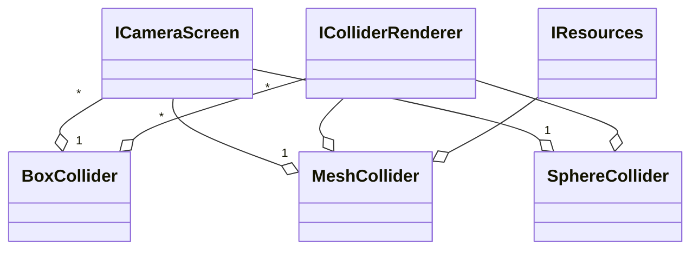
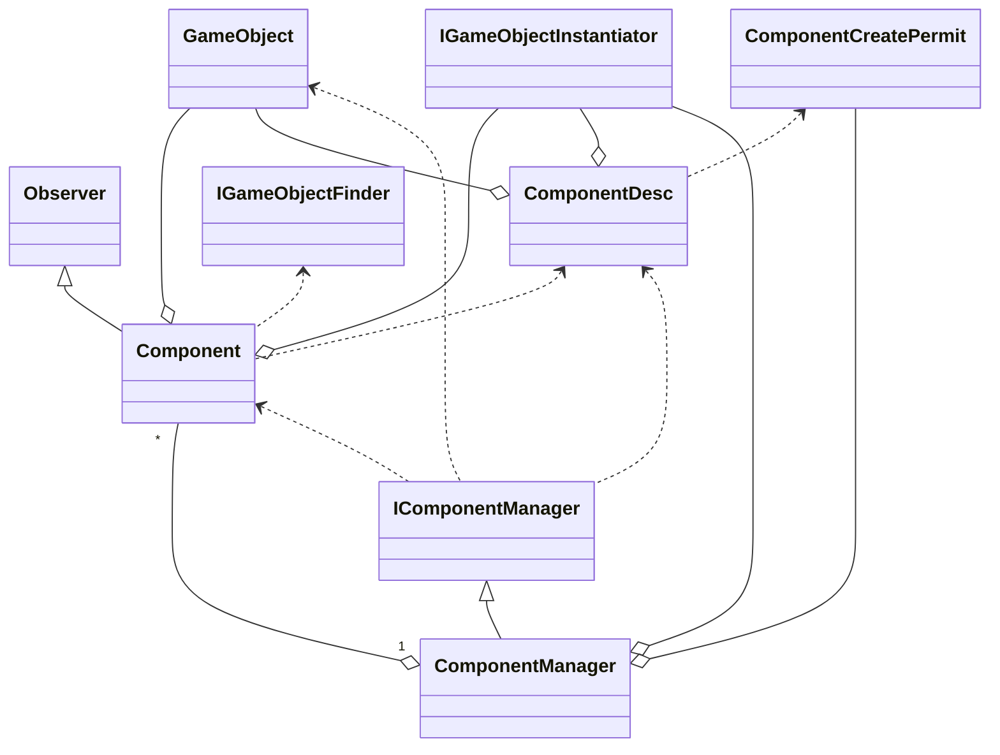
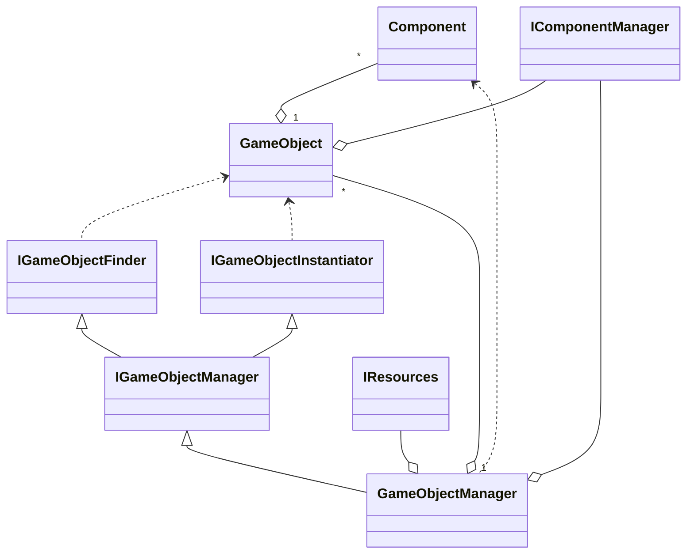
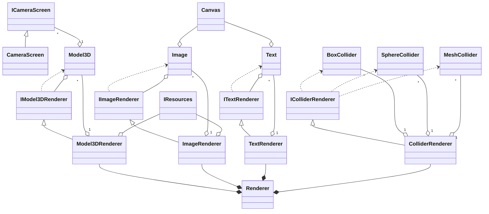
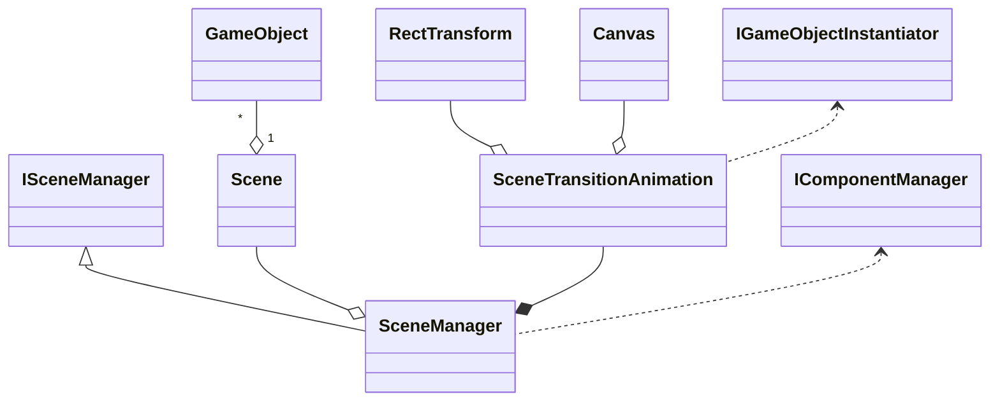
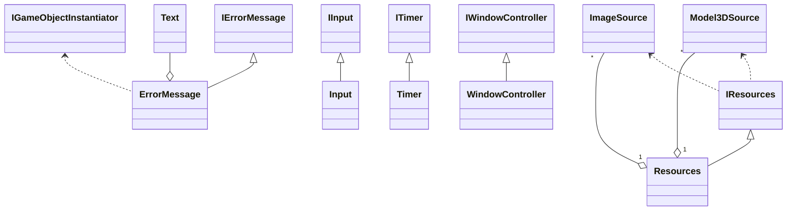

```mermaid

classDiagram

namespace Colliders{
    class BoxCollider <<Component>>
    class SphereCollider <<Component>>
    class MeshCollider <<Component>>
}

namespace Components{
    class Component
    class ComponentCreatePermit <<OnlyOne>>
    class ComponentDesc
    class ComponentManager
    class IComponentManager <<OnlyOne>>
    class Observer
    class RectTransform <<Component>>
    class Transform <<Component>>
}

namespace GameObjects{
    class GameObject
    class GameObjectManager
    class IGameObjectFinder <<OnlyOne>>
    class IGameObjectInstantiator <<OnlyOne>>
    class IGameObjectManager
}

namespace Renderings{
    class CameraScreen
    class Canvas <<Component>>
    class ColliderRenderer
    class DeviceResources <<OnlyOne>>
    class ICameraScreen <<Component>>
    class IColliderRenderer <<OnlyOne>>
    class IImageRenderer <<OnlyOne>>
    class Image <<Component>>
    class ImageRenderer
    class ImageSource
    class IModel3DRenderer <<OnlyOne>>
    class ITextRenderer <<OnlyOne>>
    class Model3D
    class Model3DRenderer
    class Model3DSource
    class Renderer <<OnlyOne>>
    class RenderingResources <<OnlyOne>>
    class Text <<Component>>
    class TextRenderer
}

namespace Scenes{
    class ISceneManager <<OnlyOne>>
    class Scene <<Component>>
    class SceneManager
    class SceneTransitionAnimation
}

namespace Systems{
    class ErrorMessage
    class IErrorMessage <<OnlyOne>>
    class IInput <<OnlyOne>>
    class Input
    class IResources <<OnlyOne>>
    class ITimer <<OnlyOne>>
    class IWindowController <<OnlyOne>>
    class OnlyOne
    class Resources
    class State
    class Timer
    class WindowController
}

ICameraScreen "*" --o "1" BoxCollider
IColliderRenderer --o BoxCollider
ICameraScreen "*" --o "1" MeshCollider
IColliderRenderer --o MeshCollider
IResources --o MeshCollider
ICameraScreen "*" --o "1" SphereCollider
IColliderRenderer --o SphereCollider

Observer <|-- Component
GameObject --o Component
IGameObjectInstantiator --o Component
ComponentDesc <.. Component
IGameObjectFinder <.. Component
IGameObjectInstantiator --o ComponentDesc
GameObject --o ComponentDesc
ComponentCreatePermit <.. ComponentDesc
IComponentManager <|-- ComponentManager
ComponentCreatePermit --o ComponentManager
Component "*" --o "1" ComponentManager
IGameObjectInstantiator --o ComponentManager
GameObject <.. IComponentManager
Component <.. IComponentManager
ComponentDesc <.. IComponentManager

Component "*" --o "1" GameObject
IComponentManager --o GameObject
GameObject <.. IGameObjectFinder
GameObject <.. IGameObjectInstantiator
IGameObjectFinder <|-- IGameObjectManager
IGameObjectInstantiator <|-- IGameObjectManager
IGameObjectManager <|-- GameObjectManager
GameObject "*" --o "1" GameObjectManager
IComponentManager --o GameObjectManager
IResources --o GameObjectManager
Component <.. GameObjectManager

ICameraScreen <|-- CameraScreen
BoxCollider <.. IColliderRenderer
SphereCollider <.. IColliderRenderer
MeshCollider <.. IColliderRenderer
IColliderRenderer <|-- ColliderRenderer
BoxCollider "*" --o "1" ColliderRenderer
SphereCollider "*" --o "1" ColliderRenderer
MeshCollider "*" --o "1" ColliderRenderer
Image <.. IImageRenderer
Canvas --o Image
IImageRenderer --o Image
IImageRenderer <|-- ImageRenderer
Image "*" --o "1" ImageRenderer
IResources --o ImageRenderer
Model3D <.. IModel3DRenderer
Text <.. ITextRenderer
ICameraScreen "*" --o "1" Model3D
IModel3DRenderer --o Model3D
IModel3DRenderer <|-- Model3DRenderer
Model3D "*" --o "1" Model3DRenderer
IResources --o Model3DRenderer
Model3DRenderer --* Renderer
ImageRenderer --* Renderer
TextRenderer --* Renderer
ColliderRenderer --* Renderer
Canvas --o Text
ITextRenderer --o Text
ITextRenderer <|-- TextRenderer
Text "*" --o "1" TextRenderer

GameObject "*" --o "1" Scene
ISceneManager <|-- SceneManager
Scene --o SceneManager
SceneTransitionAnimation --* SceneManager
IComponentManager <.. SceneManager
RectTransform --o SceneTransitionAnimation
Canvas --o SceneTransitionAnimation
IGameObjectInstantiator <.. SceneTransitionAnimation

IErrorMessage <|-- ErrorMessage
Text --o ErrorMessage
IGameObjectInstantiator <.. ErrorMessage
IInput <|-- Input
Model3DSource <.. IResources
ImageSource <.. IResources
IResources <|-- Resources
Model3DSource "*" --o "1" Resources
ImageSource "*" --o "1" Resources
ITimer <|-- Timer
IWindowController <|-- WindowController

```

```mermaid

classDiagram

ICameraScreen "*" --o "1" BoxCollider
IColliderRenderer --o BoxCollider
ICameraScreen "*" --o "1" MeshCollider
IColliderRenderer --o MeshCollider
IResources --o MeshCollider
ICameraScreen "*" --o "1" SphereCollider
IColliderRenderer --o SphereCollider

```

```mermaid

classDiagram

Observer <|-- Component
GameObject --o Component
IGameObjectInstantiator --o Component
ComponentDesc <.. Component
IGameObjectFinder <.. Component
IGameObjectInstantiator --o ComponentDesc
GameObject --o ComponentDesc
ComponentCreatePermit <.. ComponentDesc
IComponentManager <|-- ComponentManager
ComponentCreatePermit --o ComponentManager
Component "*" --o "1" ComponentManager
IGameObjectInstantiator --o ComponentManager
GameObject <.. IComponentManager
Component <.. IComponentManager
ComponentDesc <.. IComponentManager

```

```mermaid

classDiagram

Component "*" --o "1" GameObject
IComponentManager --o GameObject
GameObject <.. IGameObjectFinder
GameObject <.. IGameObjectInstantiator
IGameObjectFinder <|-- IGameObjectManager
IGameObjectInstantiator <|-- IGameObjectManager
IGameObjectManager <|-- GameObjectManager
GameObject "*" --o "1" GameObjectManager
IComponentManager --o GameObjectManager
IResources --o GameObjectManager
Component <.. GameObjectManager

```

```mermaid

classDiagram

ICameraScreen <|-- CameraScreen
BoxCollider <.. IColliderRenderer
SphereCollider <.. IColliderRenderer
MeshCollider <.. IColliderRenderer
IColliderRenderer <|-- ColliderRenderer
BoxCollider "*" --o "1" ColliderRenderer
SphereCollider "*" --o "1" ColliderRenderer
MeshCollider "*" --o "1" ColliderRenderer
Image <.. IImageRenderer
Canvas --o Image
IImageRenderer --o Image
IImageRenderer <|-- ImageRenderer
Image "*" --o "1" ImageRenderer
IResources --o ImageRenderer
Model3D <.. IModel3DRenderer
Text <.. ITextRenderer
ICameraScreen "*" --o "1" Model3D
IModel3DRenderer --o Model3D
IModel3DRenderer <|-- Model3DRenderer
Model3D "*" --o "1" Model3DRenderer
IResources --o Model3DRenderer
Model3DRenderer --* Renderer
ImageRenderer --* Renderer
TextRenderer --* Renderer
ColliderRenderer --* Renderer
Canvas --o Text
ITextRenderer --o Text
ITextRenderer <|-- TextRenderer
Text "*" --o "1" TextRenderer

```

```mermaid

classDiagram

GameObject "*" --o "1" Scene
ISceneManager <|-- SceneManager
Scene --o SceneManager
SceneTransitionAnimation --* SceneManager
IComponentManager <.. SceneManager
RectTransform --o SceneTransitionAnimation
Canvas --o SceneTransitionAnimation
IGameObjectInstantiator <.. SceneTransitionAnimation

```

```mermaid

classDiagram

IErrorMessage <|-- ErrorMessage
Text --o ErrorMessage
IGameObjectInstantiator <.. ErrorMessage
IInput <|-- Input
Model3DSource <.. IResources
ImageSource <.. IResources
IResources <|-- Resources
Model3DSource "*" --o "1" Resources
ImageSource "*" --o "1" Resources
ITimer <|-- Timer
IWindowController <|-- WindowController

```
