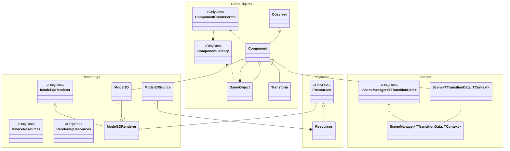
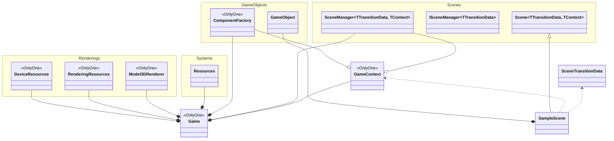

```mermaid

classDiagram

namespace Renderings{
    class DeviceResources
    class RenderingResources
    class Model3DSource
    class Model3D
    class IModel3DRenderer
    class Model3DRenderer
}

namespace Systems{
    class IResources
    class Resources
}

namespace GameObjects{
    class Observer
    class ComponentCreatePermit
    class Component
    class ComponentFactory
    class GameObject
    class Transform
}

namespace Scenes{
    class Scene["Scene&lt;TTransitionData, TContext>"]
    class ISceneManager["ISceneManager&lt;TTransitionData>"]
    class SceneManager["SceneManager&lt;TTransitionData, TContext>"]
}

<<OnlyOne>> DeviceResources
<<OnlyOne>> RenderingResources
<<OnlyOne>> IModel3DRenderer
<<OnlyOne>> IResources
<<OnlyOne>> ComponentCreatePermit
<<OnlyOne>> ComponentFactory
<<OnlyOne>> ISceneManager

Model3DSource "*" --* "1" Resources
Model3D "*" --o "1" Model3DRenderer
Component <|-- Model3D
IModel3DRenderer <|-- Model3DRenderer
IResources --o Model3DRenderer
IResources <|-- Resources
Observer <|-- Component
ComponentCreatePermit --* ComponentFactory
ComponentCreatePermit <.. Component
Component o-- GameObject
Component "*" --* "1" GameObject
Component <|-- Transform
Component <|-- Scene
ComponentFactory <.. GameObject
Scene --o SceneManager
ISceneManager <|-- SceneManager

```

```mermaid

classDiagram

namespace Renderings{
    class DeviceResources
    class RenderingResources
    class Model3DRenderer
}

namespace Systems{
    class Resources
}

namespace GameObjects{
    class ComponentFactory
    class GameObject
}

namespace Scenes{
    class Scene["Scene&lt;TTransitionData, TContext>"]
    class ISceneManager["ISceneManager&lt;TTransitionData>"]
    class SceneManager["SceneManager&lt;TTransitionData, TContext>"]
}

class GameContext
class SceneTransitionData
class Game

class SampleScene

<<OnlyOne>> DeviceResources
<<OnlyOne>> RenderingResources
<<OnlyOne>> Model3DRenderer
<<OnlyOne>> ComponentFactory
<<OnlyOne>> GameContext
<<OnlyOne>> Game

DeviceResources --* Game
RenderingResources --* Game
Model3DRenderer --* Game
Resources --* Game
ComponentFactory --o GameContext
ComponentFactory --* Game
GameObject --* SampleScene
Scene <|-- SampleScene
SceneManager --o GameContext
SceneManager --* Game
GameContext --* Game
GameContext <.. SampleScene
SceneTransitionData <.. SampleScene

```
