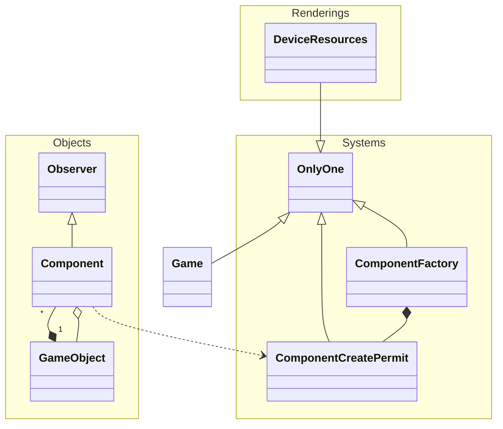

```mermaid

classDiagram

Observer <|-- Component
Component "*" --* "1" GameObject
Component o-- GameObject
Component ..> ComponentCreatePermit
DeviceResources --|> OnlyOne
OnlyOne <|-- ComponentFactory
OnlyOne <|-- ComponentCreatePermit
OnlyOne <|-- Game
ComponentFactory *-- ComponentCreatePermit

namespace Objects{
    class Observer
    class Component
    class GameObject
}

namespace Renderings{
    class DeviceResources
}

namespace Systems{
    class OnlyOne
    class ComponentFactory
    class ComponentCreatePermit
}

class Game

```
