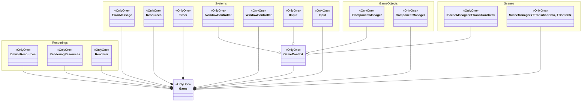
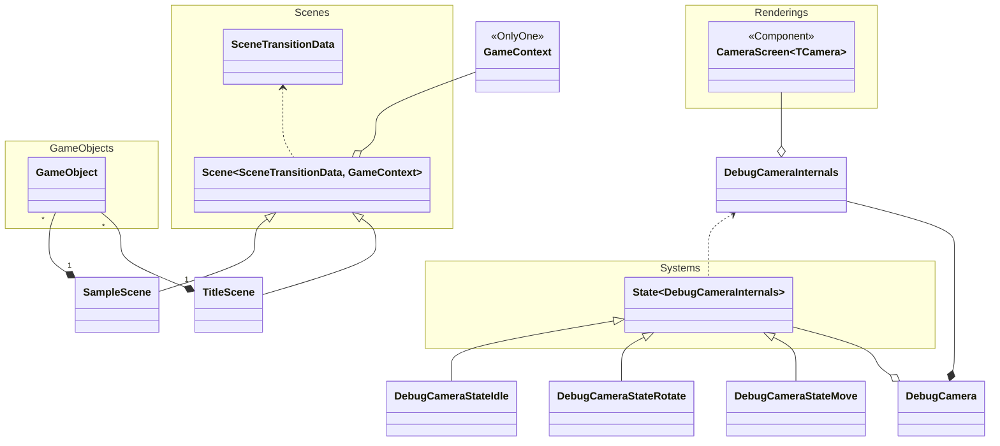

```mermaid

classDiagram

namespace Colliders{
    class BoxCollider <<Component>>
    class SphereCollider <<Component>>
    class MeshCollider <<Component>>
}

namespace Components{
    class Component
    class ComponentCreatePermit <<OnlyOne>>
    class ComponentDesc
    class ComponentManager
    class IComponentManager <<OnlyOne>>
    class Observer
    class RectTransform <<Component>>
    class Transform <<Component>>
}

namespace GameObjects{
    class GameObject
    class GameObjectManager
    class IGameObjectFinder <<OnlyOne>>
    class IGameObjectInstantiator <<OnlyOne>>
    class IGameObjectManager
}

namespace Renderings{
    class CameraScreen
    class Canvas <<Component>>
    class ColliderRenderer
    class DeviceResources <<OnlyOne>>
    class ICameraScreen <<Component>>
    class IColliderRenderer <<OnlyOne>>
    class IImageRenderer <<OnlyOne>>
    class Image <<Component>>
    class ImageRenderer
    class ImageSource
    class IModel3DRenderer <<OnlyOne>>
    class ITextRenderer <<OnlyOne>>
    class Model3D
    class Model3DRenderer
    class Model3DSource
    class Renderer <<OnlyOne>>
    class RenderingResources <<OnlyOne>>
    class Text <<Component>>
    class TextRenderer
}

namespace Scenes{
    class ISceneManager <<OnlyOne>>
    class Scene <<Component>>
    class SceneManager
    class SceneTransitionAnimation
}

namespace Systems{
    class ErrorMessage
    class IErrorMessage
    class IInput
    class Input
    class IResources
    class ITimer
    class IWindowController
    class OnlyOne
    class Resources
    class State
    class Timer
    class WindowController
}

ICameraScreen "*" --o "1" BoxCollider
IColliderRenderer --o BoxCollider
ICameraScreen "*" --o "1" MeshCollider
IColliderRenderer --o MeshCollider
IResources --o MeshCollider
ICameraScreen "*" --o "1" SphereCollider
IColliderRenderer --o SphereCollider

Observer <|-- Component
GameObject --o Component
IGameObjectInstantiator --o Component
ComponentDesc <.. Component
IGameObjectFinder <.. Component
IGameObjectInstantiator --o ComponentDesc
GameObject --o ComponentDesc
ComponentCreatePermit <.. ComponentDesc
IComponentManager <|-- ComponentManager
ComponentCreatePermit --o ComponentManager
Component "*" --o "1" ComponentManager
IGameObjectInstantiator --o ComponentManager
GameObject <.. IComponentManager
Component <.. IComponentManager
ComponentDesc <.. IComponentManager

Component "*" --o "1" GameObject
IComponentManager --o GameObject
GameObject <.. IGameObjectFinder
GameObject <.. IGameObjectInstantiator
IGameObjectFinder <|-- IGameObjectManager
IGameObjectInstantiator <|-- IGameObjectManager
IGameObjectManager <|-- GameObjectManager
GameObject "*" --o "1" GameObjectManager
IComponentManager --o GameObjectManager
IResources --o GameObjectManager
Component <.. GameObjectManager

ICameraScreen <|-- CameraScreen
BoxCollider <.. IColliderRenderer
SphereCollider <.. IColliderRenderer
MeshCollider <.. IColliderRenderer
IColliderRenderer <|-- ColliderRenderer
BoxCollider "*" --o "1" ColliderRenderer
SphereCollider "*" --o "1" ColliderRenderer
MeshCollider "*" --o "1" ColliderRenderer
Image <.. IImageRenderer
Canvas --o Image
IImageRenderer --o Image
IImageRenderer <|-- ImageRenderer
Image "*" --o "1" ImageRenderer
IResources --o ImageRenderer
Model3D <.. IModel3DRenderer
Text <.. ITextRenderer
ICameraScreen "*" --o "1" Model3D
IModel3DRenderer --o Model3D
IModel3DRenderer <|-- Model3DRenderer
Model3D "*" --o "1" Model3DRenderer
IResources --o Model3DRenderer
Model3DRenderer --* Renderer
ImageRenderer --* Renderer
TextRenderer --* Renderer
ColliderRenderer --* Renderer
Canvas --o Text
ITextRenderer --o Text
ITextRenderer <|-- TextRenderer
Text "*" --o "1" TextRenderer

GameObject "*" --o "1" Scene
ISceneManager <|-- SceneManager
Scene --o SceneManager
SceneTransitionAnimation --* SceneManager
IComponentManager <.. SceneManager

```

```mermaid

classDiagram

namespace Renderings{
    class DeviceResources
    class RenderingResources
    class Model3DSource
    class ImageSource
    class ICameraScreen
    class CameraScreen["CameraScreen&lt;TCamera>"]
    class Model3D
    class IModel3DRenderer
    class Model3DRenderer
    class Canvas
    class Image
    class IImageRenderer
    class ImageRenderer
    class Text
    class ITextRenderer
    class TextRenderer
    class IColliderRenderer
    class ColliderRenderer
    class Renderer
}

namespace Systems{
    class IErrorMessage
    class ErrorMessage
    class IResources
    class Resources
    class ITimer
    class Timer
    class IWindowController
    class WindowController
    class IInput
    class Input
    class State["State&lt;TInternals>"]
}

namespace GameObjects{
    class Observer
    class ComponentCreatePermit
    class Component
    class IComponentManager
    class ComponentManager
    class GameObject
    class Transform
    class RectTransform
}

namespace Colliders{
    class BoxCollider
    class SphereCollider
}

namespace Scenes{
    class SceneTransitionAnimation
    class Scene["Scene&lt;TTransitionData, TContext>"]
    class ISceneManager["ISceneManager&lt;TTransitionData, TContext>"]
    class SceneManager["SceneManager&lt;TTransitionData, TContext>"]
}

<<OnlyOne>> DeviceResources
<<OnlyOne>> RenderingResources
<<OnlyOne>> IModel3DRenderer
<<OnlyOne>> IImageRenderer
<<OnlyOne>> ITextRenderer
<<OnlyOne>> IColliderRenderer
<<OnlyOne>> Renderer
<<OnlyOne>> IErrorMessage
<<OnlyOne>> IResources
<<OnlyOne>> ITimer
<<OnlyOne>> IWindowController
<<OnlyOne>> IInput
<<OnlyOne>> ComponentCreatePermit
<<OnlyOne>> IComponentManager
<<OnlyOne>> ISceneManager

<<Component>> ICameraScreen
<<Component>> Model3D
<<Component>> Canvas
<<Component>> Image
<<Component>> Text
<<Component>> Transform
<<Component>> RectTransform
<<Component>> BoxCollider
<<Component>> SphereCollider
<<Component>> Scene

Model3DSource "*" --* "1" Resources
ImageSource "*" --* "1" Resources
ICameraScreen <|-- CameraScreen
ICameraScreen "*" --o "1" Model3D
ICameraScreen "*" --o "1" BoxCollider
ICameraScreen "*" --o "1" SphereCollider
Model3D "*" --o "1" Model3DRenderer
Model3D o-- IModel3DRenderer
IModel3DRenderer <|-- Model3DRenderer
Model3DRenderer --* Renderer
Canvas --o Image
Canvas --o Text
Image "*" --o "1" ImageRenderer
Image o-- IImageRenderer
IImageRenderer <|-- ImageRenderer
ImageRenderer --* Renderer
Text "*" --o "1" TextRenderer
Text o-- ITextRenderer
Text --o ErrorMessage
ITextRenderer <|-- TextRenderer
TextRenderer --* Renderer
IColliderRenderer <|-- ColliderRenderer
ColliderRenderer --* Renderer
IErrorMessage <|-- ErrorMessage
IComponentManager <.. ErrorMessage
IResources --o Model3DRenderer
IResources --o ImageRenderer
IResources <|-- Resources
ITimer <|-- Timer
IWindowController <|-- WindowController
IInput <|-- Input
Observer <|-- Component
ComponentCreatePermit --* ComponentManager
ComponentCreatePermit <.. Component
Component o-- GameObject
Component "*" --* "1" GameObject
IComponentManager <|-- ComponentManager
IComponentManager <.. GameObject
IComponentManager <.. SceneTransitionAnimation
GameObject --* ErrorMessage
GameObject --* SceneTransitionAnimation
RectTransform --o SceneTransitionAnimation
BoxCollider "*" --o "1" ColliderRenderer
BoxCollider o-- IColliderRenderer
SphereCollider "*" --o "1" ColliderRenderer
SphereCollider o-- IColliderRenderer
SceneTransitionAnimation --* SceneManager
Scene --o SceneManager
ISceneManager <|-- SceneManager

```

```mermaid

classDiagram

namespace Renderings{
    class DeviceResources
    class RenderingResources
    class Renderer
}

namespace Systems{
    class ErrorMessage
    class Resources
    class Timer
    class IWindowController
    class WindowController
    class IInput
    class Input
}

namespace GameObjects{
    class IComponentManager
    class ComponentManager
}

namespace Scenes{
    class ISceneManager["ISceneManager&lt;TTransitionData>"]
    class SceneManager["SceneManager&lt;TTransitionData, TContext>"]
}

class GameContext
class Game

<<OnlyOne>> DeviceResources
<<OnlyOne>> RenderingResources
<<OnlyOne>> Renderer
<<OnlyOne>> ErrorMessage
<<OnlyOne>> Resources
<<OnlyOne>> Timer
<<OnlyOne>> IWindowController
<<OnlyOne>> WindowController
<<OnlyOne>> IInput
<<OnlyOne>> Input
<<OnlyOne>> IComponentManager
<<OnlyOne>> ComponentManager
<<OnlyOne>> ISceneManager
<<OnlyOne>> SceneManager
<<OnlyOne>> GameContext
<<OnlyOne>> Game

DeviceResources --* Game
RenderingResources --* Game
Renderer --* Game
ErrorMessage --* Game
Resources --* Game
Timer --* Game
WindowController --* Game
Input --* Game
ComponentManager --* Game
SceneManager --* Game
GameContext --* Game
IWindowController --o GameContext
IInput --o GameContext
IComponentManager --o GameContext
ISceneManager --o GameContext

```

``` mermaid

classDiagram

namespace Renderings{
    class CameraScreen["CameraScreen&lt;TCamera>"]
}

namespace Systems{
    class DebugCameraState["State&lt;DebugCameraInternals>"]
}

namespace GameObjects{
    class GameObject
}

namespace Scenes{
    class SceneTransitionData
    class Scene["Scene&lt;SceneTransitionData, GameContext>"]
}

class GameContext

class SampleScene
class TitleScene

class DebugCameraInternals
class DebugCameraStateIdle
class DebugCameraStateRotate
class DebugCameraStateMove
class DebugCamera

<<OnlyOne>> GameContext

<<Component>> CameraScreen

GameContext --o Scene
SceneTransitionData <.. Scene

Scene <|-- SampleScene
GameObject "*" --* "1" SampleScene
Scene <|-- TitleScene
GameObject "*" --* "1" TitleScene

CameraScreen --o DebugCameraInternals
DebugCameraInternals <.. DebugCameraState
DebugCameraState <|-- DebugCameraStateIdle
DebugCameraState <|-- DebugCameraStateRotate
DebugCameraState <|-- DebugCameraStateMove
DebugCameraState --o DebugCamera
DebugCameraInternals --* DebugCamera

```
