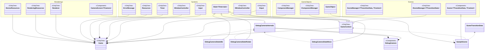

```mermaid

classDiagram

namespace Renderings{
    class DeviceResources
    class RenderingResources
    class Model3DSource
    class ImageSource
    class ICameraScreen
    class CameraScreen["CameraScreen&lt;TCamera>"]
    class Model3D
    class IModel3DRenderer
    class Model3DRenderer
    class Canvas
    class Image
    class IImageRenderer
    class ImageRenderer
    class Text
    class ITextRenderer
    class TextRenderer
    class IColliderRenderer
    class ColliderRenderer
    class Renderer
}

namespace Systems{
    class IErrorMessage
    class ErrorMessage
    class IResources
    class Resources
    class ITimer
    class Timer
    class IWindowController
    class WindowController
    class IInput
    class Input
    class State["State&lt;TInternals>"]
}

namespace GameObjects{
    class Observer
    class ComponentCreatePermit
    class Component
    class IComponentManager
    class ComponentManager
    class GameObject
    class Transform
    class RectTransform
}

namespace Colliders{
    class BoxCollider
    class SphereCollider
}

namespace Scenes{
    class SceneTransitionAnimation
    class Scene["Scene&lt;TTransitionData, TContext>"]
    class ISceneManager["ISceneManager&lt;TTransitionData, TContext>"]
    class SceneManager["SceneManager&lt;TTransitionData, TContext>"]
}

<<OnlyOne>> DeviceResources
<<OnlyOne>> RenderingResources
<<OnlyOne>> IModel3DRenderer
<<OnlyOne>> IImageRenderer
<<OnlyOne>> ITextRenderer
<<OnlyOne>> IColliderRenderer
<<OnlyOne>> Renderer
<<OnlyOne>> IErrorMessage
<<OnlyOne>> IResources
<<OnlyOne>> ITimer
<<OnlyOne>> IWindowController
<<OnlyOne>> IInput
<<OnlyOne>> ComponentCreatePermit
<<OnlyOne>> IComponentManager
<<OnlyOne>> ISceneManager

<<Component>> ICameraScreen
<<Component>> Model3D
<<Component>> Canvas
<<Component>> Image
<<Component>> Text
<<Component>> Transform
<<Component>> RectTransform
<<Component>> BoxCollider
<<Component>> SphereCollider
<<Component>> Scene

Model3DSource "*" --* "1" Resources
ImageSource "*" --* "1" Resources
ICameraScreen <|-- CameraScreen
ICameraScreen "*" --o "1" Model3D
ICameraScreen "*" --o "1" BoxCollider
ICameraScreen "*" --o "1" SphereCollider
Model3D "*" --o "1" Model3DRenderer
Model3D o-- IModel3DRenderer
IModel3DRenderer <|-- Model3DRenderer
Model3DRenderer --* Renderer
Canvas --o Image
Canvas --o Text
Image "*" --o "1" ImageRenderer
Image o-- IImageRenderer
IImageRenderer <|-- ImageRenderer
ImageRenderer --* Renderer
Text "*" --o "1" TextRenderer
Text o-- ITextRenderer
Text --o ErrorMessage
ITextRenderer <|-- TextRenderer
TextRenderer --* Renderer
IColliderRenderer <|-- ColliderRenderer
ColliderRenderer --* Renderer
IErrorMessage <|-- ErrorMessage
IComponentManager <.. ErrorMessage
IResources --o Model3DRenderer
IResources --o ImageRenderer
IResources <|-- Resources
ITimer <|-- Timer
IWindowController <|-- WindowController
IInput <|-- Input
Observer <|-- Component
ComponentCreatePermit --* ComponentManager
ComponentCreatePermit <.. Component
Component o-- GameObject
Component "*" --* "1" GameObject
IComponentManager <|-- ComponentManager
IComponentManager <.. GameObject
IComponentManager <.. SceneTransitionAnimation
GameObject --* ErrorMessage
GameObject --* SceneTransitionAnimation
RectTransform --o SceneTransitionAnimation
BoxCollider "*" --o "1" ColliderRenderer
BoxCollider o-- IColliderRenderer
SphereCollider "*" --o "1" ColliderRenderer
SphereCollider o-- IColliderRenderer
SceneTransitionAnimation --* SceneManager
Scene --o SceneManager
ISceneManager <|-- SceneManager

```

```mermaid

classDiagram

namespace Renderings{
    class DeviceResources
    class RenderingResources
    class Renderer
    class CameraScreen["CameraScreen&lt;TCamera>"]
}

namespace Systems{
    class ErrorMessage
    class Resources
    class Timer
    class IWindowController
    class WindowController
    class IInput
    class Input
    class State["State&lt;TInternals>"]
}

namespace GameObjects{
    class IComponentManager
    class ComponentManager
    class GameObject
}

namespace Scenes{
    class Scene["Scene&lt;TTransitionData, TContext>"]
    class ISceneManager["ISceneManager&lt;TTransitionData>"]
    class SceneManager["SceneManager&lt;TTransitionData, TContext>"]
}

class GameContext
class SceneTransitionData
class Game

class SampleScene

class DebugCameraInternals
class DebugCameraStateIdle
class DebugCameraStateRotate
class DebugCameraStateMove
class DebugCamera

<<OnlyOne>> DeviceResources
<<OnlyOne>> RenderingResources
<<OnlyOne>> Renderer
<<OnlyOne>> ErrorMessage
<<OnlyOne>> Resources
<<OnlyOne>> Timer
<<OnlyOne>> IWindowController
<<OnlyOne>> WindowController
<<OnlyOne>> IInput
<<OnlyOne>> Input
<<OnlyOne>> IComponentManager
<<OnlyOne>> ComponentManager
<<OnlyOne>> ISceneManager
<<OnlyOne>> SceneManager
<<OnlyOne>> GameContext
<<OnlyOne>> Game

<<Component>> CameraScreen
<<Component>> Scene
<<Component>> DebugCamera

DeviceResources --* Game
RenderingResources --* Game
Renderer --* Game
ErrorMessage --* Game
Resources --* Game
Timer --* Game
WindowController --* Game
Input --* Game
ComponentManager --* Game
SceneManager --* Game
GameContext --* Game
IWindowController --o GameContext
IInput --o GameContext
IComponentManager --o GameContext
ISceneManager --o GameContext
GameObject "*" --* "1" SampleScene
Scene <|-- SampleScene
GameContext <.. SampleScene
SceneTransitionData <.. SampleScene

CameraScreen --o DebugCameraInternals
DebugCameraInternals <.. DebugCameraStateIdle
DebugCameraInternals <.. DebugCameraStateRotate
DebugCameraInternals <.. DebugCameraStateMove
State <|-- DebugCameraStateIdle
State <|-- DebugCameraStateRotate
State <|-- DebugCameraStateMove
DebugCameraInternals --* DebugCamera
DebugCameraInternals --* DebugCamera

```
