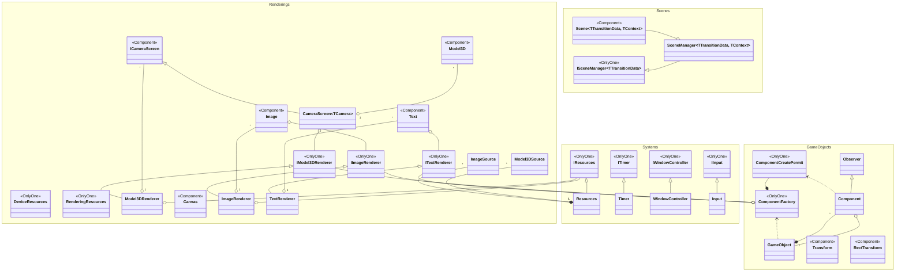

```mermaid

classDiagram

namespace Renderings{
    class DeviceResources
    class RenderingResources
    class Model3DSource
    class Model3D
    class ICameraScreen
    class CameraScreen["CameraScreen&lt;TCamera>"]
    class IModel3DRenderer
    class Model3DRenderer
    class ImageSource
    class Canvas
    class Image
    class IImageRenderer
    class ImageRenderer
    class Text
    class ITextRenderer
    class TextRenderer
}

namespace Systems{
    class IResources
    class Resources
    class ITimer
    class Timer
    class IWindowController
    class WindowController
    class IInput
    class Input
}

namespace GameObjects{
    class Observer
    class ComponentCreatePermit
    class Component
    class ComponentFactory
    class GameObject
    class Transform
    class RectTransform
}

namespace Scenes{
    class Scene["Scene&lt;TTransitionData, TContext>"]
    class ISceneManager["ISceneManager&lt;TTransitionData>"]
    class SceneManager["SceneManager&lt;TTransitionData, TContext>"]
}

<<OnlyOne>> DeviceResources
<<OnlyOne>> RenderingResources
<<OnlyOne>> IModel3DRenderer
<<OnlyOne>> IImageRenderer
<<OnlyOne>> ITextRenderer
<<OnlyOne>> IResources
<<OnlyOne>> ITimer
<<OnlyOne>> IWindowController
<<OnlyOne>> IInput
<<OnlyOne>> ComponentCreatePermit
<<OnlyOne>> ComponentFactory
<<OnlyOne>> ISceneManager

<<Component>> Model3D
<<Component>> ICameraScreen
<<Component>> Canvas
<<Component>> Image
<<Component>> Text
<<Component>> Transform
<<Component>> RectTransform
<<Component>> Scene

Model3DSource "*" --* "1" Resources
Model3D "*" --o "1" CameraScreen
ICameraScreen <|-- CameraScreen
ICameraScreen "*" --o "1" Model3DRenderer
CameraScreen o-- IModel3DRenderer
IModel3DRenderer <|-- Model3DRenderer
IModel3DRenderer --o ComponentFactory
ImageSource "*" --* "1" Resources
Image "*" --o "1" ImageRenderer
Image o-- IImageRenderer
IImageRenderer <|-- ImageRenderer
IImageRenderer --o ComponentFactory
Text "*" --o "1" TextRenderer
Text o-- ITextRenderer
ITextRenderer <|-- TextRenderer
ITextRenderer --o ComponentFactory
IResources --o Model3DRenderer
IResources --o ImageRenderer
IResources <|-- Resources
ITimer <|-- Timer
IWindowController <|-- WindowController
IInput <|-- Input
Observer <|-- Component
ComponentCreatePermit --* ComponentFactory
ComponentCreatePermit <.. Component
Component o-- GameObject
Component "*" --* "1" GameObject
ComponentFactory <.. GameObject
Scene --o SceneManager
ISceneManager <|-- SceneManager

```

```mermaid

classDiagram

namespace Renderings{
    class DeviceResources
    class RenderingResources
    class Model3DRenderer
    class ImageRenderer
    class TextRenderer
}

namespace Systems{
    class Resources
    class Timer
    class IWindowController
    class WindowController
    class IInput
    class Input
}

namespace GameObjects{
    class ComponentFactory
    class GameObject
}

namespace Scenes{
    class Scene["Scene&lt;TTransitionData, TContext>"]
    class ISceneManager["ISceneManager&lt;TTransitionData>"]
    class SceneManager["SceneManager&lt;TTransitionData, TContext>"]
}

class GameContext
class SceneTransitionData
class Game

class SampleScene

<<OnlyOne>> DeviceResources
<<OnlyOne>> RenderingResources
<<OnlyOne>> Model3DRenderer
<<OnlyOne>> ImageRenderer
<<OnlyOne>> TextRenderer
<<OnlyOne>> Resources
<<OnlyOne>> Timer
<<OnlyOne>> IWindowController
<<OnlyOne>> WindowController
<<OnlyOne>> IInput
<<OnlyOne>> Input
<<OnlyOne>> ComponentFactory
<<OnlyOne>> ISceneManager
<<OnlyOne>> SceneManager
<<OnlyOne>> GameContext
<<OnlyOne>> Game

<<Component>> Scene

DeviceResources --* Game
RenderingResources --* Game
Model3DRenderer --* Game
ImageRenderer --* Game
TextRenderer --* Game
Resources --* Game
Timer --* Game
IWindowController --o GameContext
WindowController --* Game
IInput --o GameContext
Input --* Game
ComponentFactory --o GameContext
ComponentFactory --* Game
GameObject "*" --* "1" SampleScene
Scene <|-- SampleScene
ISceneManager --o GameContext
SceneManager --* Game
GameContext --* Game
GameContext <.. SampleScene
SceneTransitionData <.. SampleScene

```
